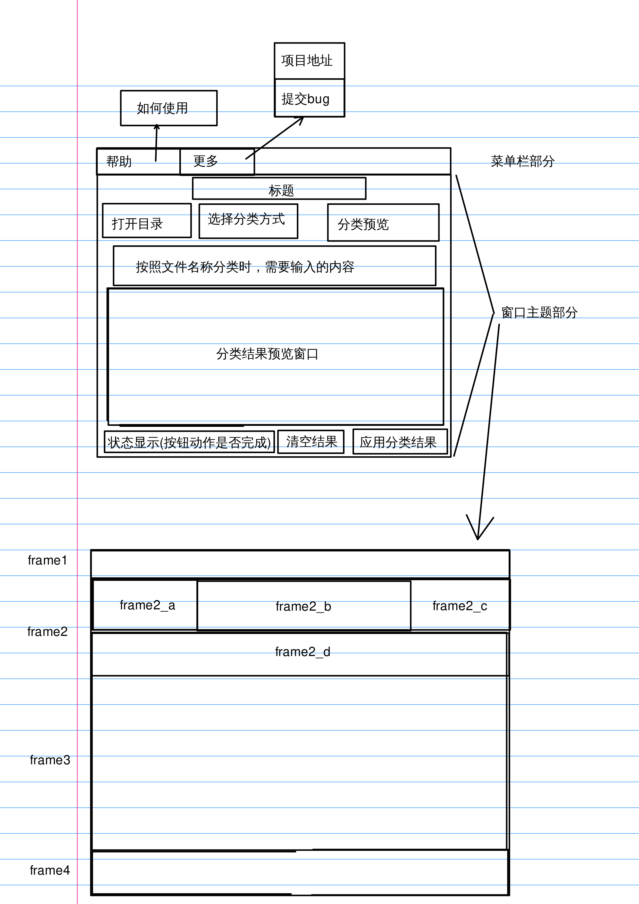

## Classify 文档分类工具

### 功能

对文件进行分类(同一类文件放入同一个目录下)

* 分类方法:
    1. 文件后缀名
    2. 关键词

### 各文件内容

| 文件名称        | 说明         |
|-----------------|--------------|
| classify.py     | 功能模块     |
| ui.py           | UI 模块      |
| expectation.png | 设计草图     |
| test.py         | 测试         |
| create_test.sh  | 创建测试目录 |

### 设计草图

